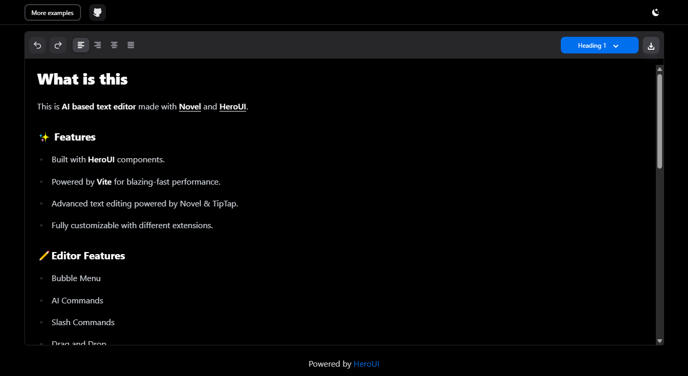

**AI based text editor** made with [Novel](https://novel.sh/docs/introduction) and [HeroUI](https://www.heroui.com/).

Live link: [https://bibekbhusal0.github.io/text-editor/](https://bibekbhusal0.github.io/text-editor/)

## ✨ Features

- Built with **HeroUI** components.
- Powered by **Vite** for blazing-fast performance.
- Advanced text editing powered by Novel & TipTap.
- Fully customizable with different extensions.

## ✏Editor Features

- Bubble Menu
- AI Commands
- Slash Commands
- Drag and Drop
- Supports various blocks
  - Bullet list
  - Task List
  - Numbered list
  - Code Block
  - Quote
- **Bold**, <u>Underline</u>, _Italic,_ ~~Strike Through~~, `Inline Code`.
- Intuitive keyboard shortcuts
- Markdown syntax
- And more ...

## Screenshots




## 📦 Tech Stack

- Vite
- TypeScript
- HeroUI
- Tailwind CSS
- TipTap
- Novel

## 🚀 Getting Started

Clone the repo and install dependencies:

```bash
git clone https://github.com/BibekBhusal0/text-editor
cd text-editor
npm install
npm run dev
```

## 📜 License

MIT — Free to use and modify for personal and commercial use.
